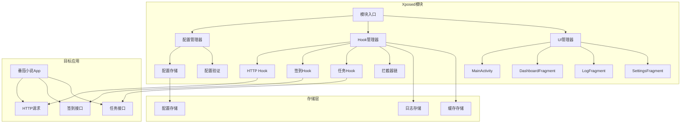
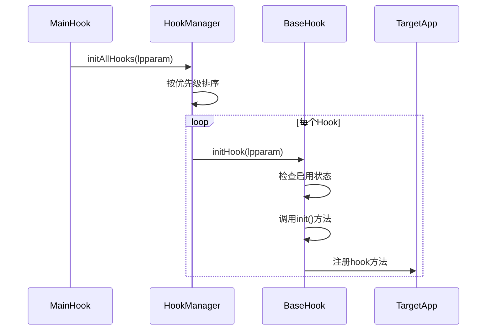
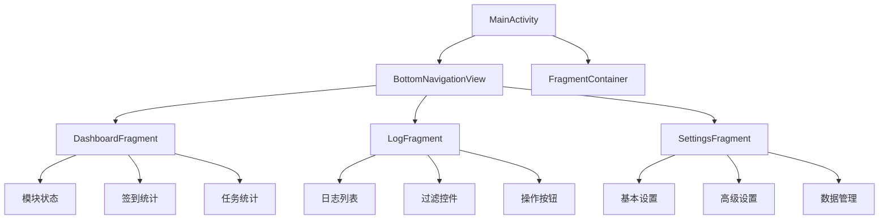
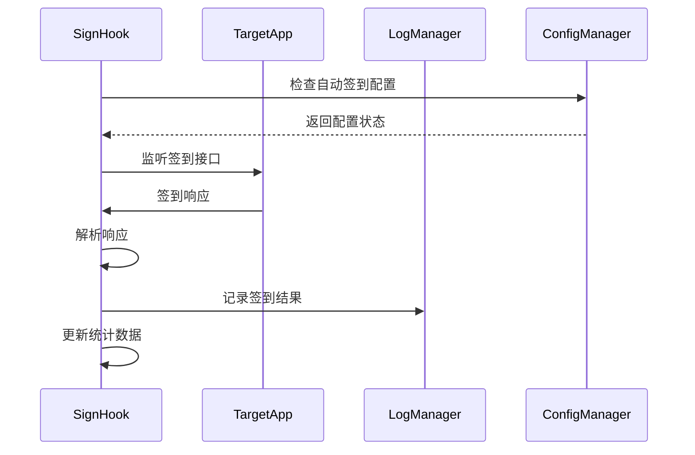
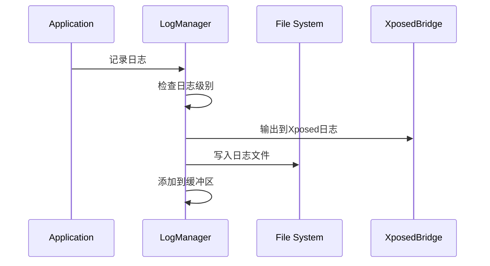

# 系统架构文档

## 架构概述

番茄小说自动签到模块采用模块化架构设计，基于Xposed框架实现对目标应用的hook功能。系统分为四个主要层次：Hook层、配置层、UI层和工具层。

## 架构图



## 模块化架构

### 1. Hook层

Hook层负责与目标应用的交互，通过Xposed框架hook目标应用的方法。

#### 核心组件

- **BaseHook**：Hook基类，提供Hook生命周期管理
- **HookManager**：Hook管理器，负责Hook的注册、初始化和销毁
- **HttpHook**：HTTP请求Hook，拦截HTTP请求和响应
- **SignHook**：签到Hook，处理签到逻辑
- **TaskHook**：任务Hook，处理任务逻辑

#### Hook执行流程



### 2. 配置层

配置层负责管理模块的配置信息，支持配置的读取、保存、验证和导入导出。

#### 核心组件

- **ConfigManager**：配置管理器，提供配置的读写操作
- **Config**：配置模型，定义配置的数据结构

#### 配置存储结构

```json
{
  "version": 1,
  "auto_sign_enabled": true,
  "auto_task_enabled": true,
  "logging_enabled": true,
  "target_package": "com.dragon.read",
  "url_patterns": ["sign", "task", "reward", "gold", "luckycat"]
}
```

### 3. UI层

UI层负责用户界面的显示和交互，采用Fragment架构。

#### 核心组件

- **MainActivity**：主Activity，管理Fragment切换
- **DashboardFragment**：仪表盘，显示模块状态和统计信息
- **LogFragment**：日志查看，支持日志过滤和搜索
- **SettingsFragment**：设置界面，管理模块配置

#### UI架构图



### 4. 工具层

工具层提供通用的工具类，包括日志管理、文件操作等。

#### 核心组件

- **LogManager**：日志管理器，提供日志记录、文件管理、过滤查询等功能

## 数据流

### 1. 签到流程



### 2. 日志记录流程



## 线程模型

### 主线程
- UI更新
- 用户交互处理

### Hook线程
- Hook方法执行
- HTTP请求拦截
- 签到响应处理

### 后台线程
- 日志文件写入
- 配置文件保存
- 重试机制执行

## 错误处理

### 1. Hook错误
- 记录错误日志
- 禁用失败的Hook
- 尝试恢复机制

### 2. 配置错误
- 使用默认配置
- 记录错误日志
- 提示用户修复

### 3. 网络错误
- 重试机制
- 指数退避策略
- 错误日志记录

## 性能优化

### 1. 内存优化
- 使用缓冲区限制日志数量
- 及时释放不需要的资源
- 避免内存泄漏

### 2. CPU优化
- 异步处理耗时操作
- 避免主线程阻塞
- 使用高效的算法

### 3. 存储优化
- 日志文件轮转
- 限制日志文件大小
- 定期清理旧日志

## 安全考虑

### 1. 数据安全
- 敏感数据加密存储
- 避免日志记录敏感信息
- 使用安全的存储机制

### 2. 网络安全
- 验证SSL证书
- 使用HTTPS协议
- 防止中间人攻击

### 3. 权限管理
- 最小权限原则
- 避免不必要的权限
- 安全的文件访问

## 扩展性设计

### 1. Hook扩展
- 继承BaseHook基类
- 实现init方法
- 注册到HookManager

### 2. 配置扩展
- 在Config模型中添加字段
- 在ConfigManager中添加方法
- 在SettingsFragment中添加UI

### 3. UI扩展
- 创建新的Fragment
- 在MainActivity中添加导航
- 实现Fragment间通信

## 测试策略

### 1. 单元测试
- 测试各个组件的功能
- 测试边界条件
- 测试错误处理

### 2. 集成测试
- 测试组件间的交互
- 测试完整的业务流程
- 测试UI交互

### 3. 性能测试
- 测试内存使用
- 测试CPU占用
- 测试响应时间
