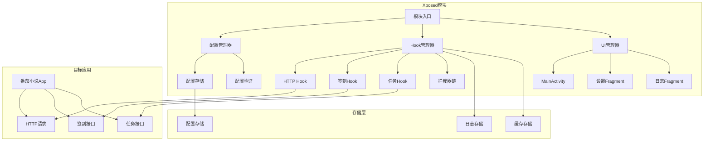
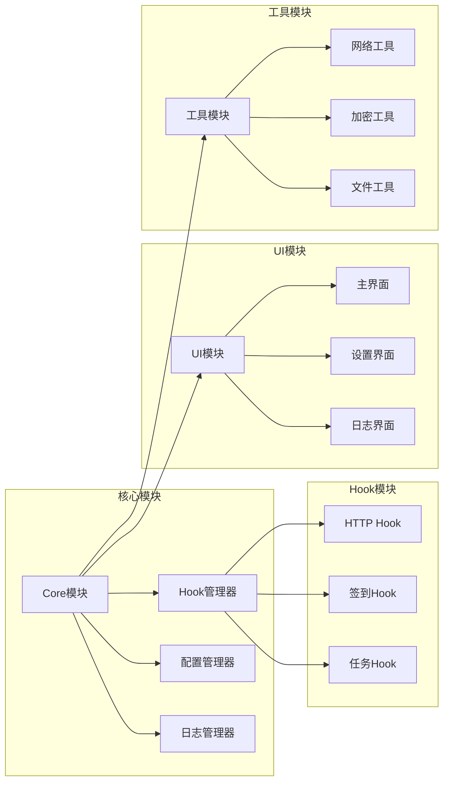

# 番茄小说自动签到模块重构设计

Feature Name: fanqie-auto-refactor
Updated: 2026-06-26

## Description

本设计文档定义了番茄小说自动签到Xposed模块的全面重构方案。通过模块化架构、现代化UI设计、功能增强和配置管理系统，提升代码质量、用户体验和功能完整性。

## Architecture

### 整体架构图



### 模块化架构



## Components and Interfaces

### 1. 核心组件

#### 1.1 ModuleEntry（模块入口）
```java
public class ModuleEntry implements IXposedHookLoadPackage {
    // 负责模块初始化和生命周期管理
    // 协调各管理器工作
}
```

#### 1.2 ConfigManager（配置管理器）
```java
public class ConfigManager {
    // 配置加载、保存、验证
    // 支持默认配置和用户配置
    // 配置变更通知机制
}
```

#### 1.3 HookManager（Hook管理器）
```java
public class HookManager {
    // 管理所有Hook实例
    // 支持Hook的启用/禁用
    // Hook执行链管理
}
```

#### 1.4 LogManager（日志管理器）
```java
public class LogManager {
    // 统一日志记录
    // 日志文件管理
    // 日志过滤和查询
}
```

### 2. Hook组件

#### 2.1 BaseHook（Hook基类）
```java
public abstract class BaseHook {
    protected String name;
    protected boolean enabled;
    
    public abstract void init(XC_LoadPackage.LoadPackageParam lpparam);
    public abstract void enable();
    public abstract void disable();
}
```

#### 2.2 HttpHook（HTTP Hook）
```java
public class HttpHook extends BaseHook {
    // 拦截HTTP请求和响应
    // 支持请求/响应修改
    // 统计请求信息
}
```

#### 2.3 SignHook（签到Hook）
```java
public class SignHook extends BaseHook {
    // 自动签到逻辑
    // 签到结果处理
    // 签到统计
}
```

#### 2.4 TaskHook（任务Hook）
```java
public class TaskHook extends BaseHook {
    // 自动任务处理
    // 任务状态跟踪
    // 任务奖励收集
}
```

### 3. UI组件

#### 3.1 MainActivity（主Activity）
```java
public class MainActivity extends AppCompatActivity {
    // 使用Fragment管理界面
    // 底部导航栏
    // 主题切换支持
}
```

#### 3.2 DashboardFragment（仪表盘）
```java
public class DashboardFragment extends Fragment {
    // 显示模块状态
    // 签到统计信息
    // 快速操作按钮
}
```

#### 3.3 SettingsFragment（设置界面）
```java
public class SettingsFragment extends PreferenceFragmentCompat {
    // 配置管理界面
    // 开关控制
    // 高级设置
}
```

#### 3.4 LogFragment（日志界面）
```java
public class LogFragment extends Fragment {
    // 日志查看界面
    // 日志过滤功能
    // 日志导出功能
}
```

### 4. 数据模型

#### 4.1 Config（配置模型）
```java
public class Config {
    private boolean autoSignEnabled;
    private boolean autoTaskEnabled;
    private boolean loggingEnabled;
    private String targetPackage;
    private List<String> urlPatterns;
    // getters/setters
}
```

#### 4.2 SignRecord（签到记录）
```java
public class SignRecord {
    private long timestamp;
    private boolean success;
    private int reward;
    private String details;
    // getters/setters
}
```

#### 4.3 LogEntry（日志条目）
```java
public class LogEntry {
    private long timestamp;
    private String level;
    private String tag;
    private String message;
    private String stackTrace;
    // getters/setters
}
```

## Data Models

### 配置存储结构
```json
{
  "version": 1,
  "auto_sign_enabled": true,
  "auto_task_enabled": true,
  "logging_enabled": true,
  "target_package": "com.dragon.read",
  "url_patterns": [
    "sign",
    "task",
    "reward",
    "gold",
    "luckycat"
  ],
  "advanced": {
    "hook_timeout": 5000,
    "max_log_size": 10485760,
    "log_rotation_count": 5
  }
}
```

### 日志存储结构
```json
{
  "entries": [
    {
      "timestamp": 1624672800000,
      "level": "INFO",
      "tag": "SignHook",
      "message": "签到成功，获得金币: +100",
      "stack_trace": null
    }
  ]
}
```

### 签到记录结构
```json
{
  "records": [
    {
      "timestamp": 1624672800000,
      "success": true,
      "reward": 100,
      "details": "每日签到成功"
    }
  ],
  "statistics": {
    "total_sign_days": 30,
    "total_reward": 3000,
    "success_rate": 0.95
  }
}
```

## Correctness Properties

### 不变量
1. 配置完整性：配置文件必须包含所有必需字段
2. 日志一致性：日志条目必须包含时间戳、级别、标签、消息
3. 签到记录有效性：签到记录必须包含成功状态和奖励信息
4. Hook状态一致性：Hook的启用/禁用状态必须与配置同步

### 约束条件
1. 配置文件大小不超过1MB
2. 日志文件大小不超过10MB
3. 签到记录保留最近365天
4. Hook超时时间不超过10秒

## Error Handling

### 错误分类
1. **配置错误**：配置文件损坏、字段缺失、值无效
2. **Hook错误**：方法找不到、参数不匹配、执行超时
3. **网络错误**：请求失败、响应解析错误、SSL错误
4. **存储错误**：文件读写失败、存储空间不足、权限问题

### 错误处理策略
1. **配置错误**：使用默认配置，记录错误日志，提示用户
2. **Hook错误**：禁用相关Hook，记录错误日志，尝试恢复
3. **网络错误**：重试机制，指数退避，记录错误详情
4. **存储错误**：清理缓存，压缩日志，提示用户处理

### 错误恢复机制
1. **自动恢复**：配置错误时使用默认值，网络错误时重试
2. **手动恢复**：提供修复选项，清除损坏数据，重置配置
3. **降级处理**：禁用非核心功能，减少资源占用，保持基本功能

## Test Strategy

### 单元测试
1. **配置管理测试**：配置加载、保存、验证、默认值处理
2. **Hook测试**：Hook初始化、启用/禁用、执行逻辑
3. **工具类测试**：网络工具、加密工具、文件工具
4. **数据模型测试**：模型创建、序列化、反序列化

### 集成测试
1. **模块集成测试**：各组件协同工作、配置生效、Hook执行
2. **UI集成测试**：界面显示、用户交互、数据更新
3. **存储集成测试**：配置存储、日志存储、缓存管理

### 端到端测试
1. **功能测试**：自动签到、自动任务、日志记录
2. **性能测试**：内存使用、CPU占用、响应时间
3. **兼容性测试**：不同Android版本、不同设备、不同Xposed框架

### 测试工具
1. **JUnit**：单元测试框架
2. **Mockito**：Mock框架
3. **Espresso**：UI测试框架
4. **XposedTestingModule**：Xposed模块测试工具

## Implementation Plan

### Phase 1: 基础架构重构（1-2天）
1. 创建模块化目录结构
2. 实现配置管理器
3. 实现日志管理器
4. 创建Hook基类和管理器

### Phase 2: Hook功能重构（2-3天）
1. 重构HTTP Hook
2. 重构签到Hook
3. 新增任务Hook
4. 实现Hook执行链

### Phase 3: UI界面重构（2-3天）
1. 创建XML布局文件
2. 实现主Activity和Fragment
3. 实现设置界面
4. 实现日志查看界面

### Phase 4: 功能增强（3-4天）
1. 实现自动签到逻辑
2. 实现自动任务逻辑
3. 实现配置导入/导出
4. 实现日志导出功能

### Phase 5: 测试和优化（2-3天）
1. 编写单元测试
2. 进行集成测试
3. 性能优化
4. 安全加固

## References

[^1]: (Xposed Framework) - Xposed框架官方文档
[^2]: (Android Architecture) - Android架构指南
[^3]: (Material Design) - Material Design设计规范
